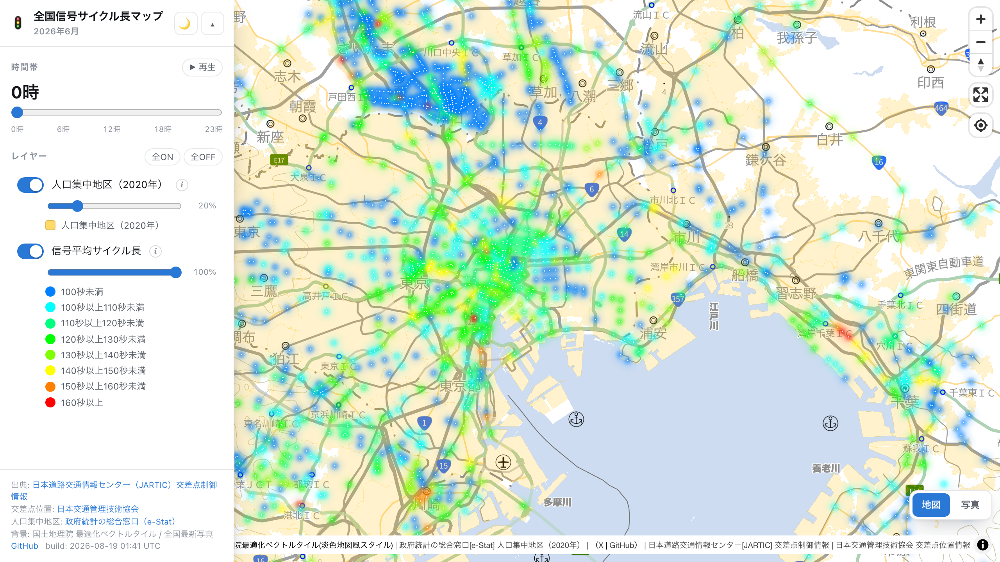

# jartic-traffic-signal-cycle-converter

日本道路交通情報センター（JARTIC）がオープンデータとして公開している[交差点制御情報](https://www.jartic.or.jp/)から、信号交差点ごと・時間帯ごとの**平均サイクル長**を算出し、PMTiles に変換して Web 地図で表示するツールです。

## Public Website
https://shiwaku.github.io/jartic-traffic-signal-cycle-converter/

## サンプル画像


## 収録データ

<!-- dataset:begin -->
| 項目 | 内容 |
|---|---|
| 対象年月 | 2026年6月 |
| 公開日 | 2026-08-01（JARTIC） |
| 交差点数 | 10,831箇所（うち座標付与 10,543） |
| レコード数 | 259,938件（交差点 × 24時間帯） |
| 地図に載るレコード数 | 253,031件（座標を付与できた分） |
| 結合率 | 97.34%（[data/join_report.json](data/join_report.json) に情報源コード別の内訳） |
<!-- dataset:end -->

サイクル長は青・黄・赤が一巡する周期の長さで、交通量の多い交差点ほど長くなる傾向があります。全国の中央値は深夜が約100秒、朝8時と夕方17時に約138秒のピークがあります（[data/hourly_stats.json](data/hourly_stats.json)）。

### 結合率について
交差点制御情報には座標が無く、交差点は `情報源コード + 交差点番号` でしか識別できません。座標は日本交通管理技術協会の[交差点位置情報](https://www.tmt.or.jp/research/index10.html#japanMap)から取得して結合しています。両者の収録範囲は完全には一致しないため、結合率をデータ品質の指標として `data/join_report.json` に記録し、更新のたびに差分を追えるようにしています。

<!-- lowjoin:begin -->
2026年6月時点で結合率が低い情報源コード:

| 情報源コード | 都道府県 | 制御情報 | 位置情報あり | 結合率 |
|---|---|---|---|---|
| 301C | 三重 | 328 | 159 | 48.5% |
| 3009 | 秋田 | 129 | 117 | 90.7% |
| 3010 | 埼玉 | 1,185 | 1,109 | 93.6% |
<!-- lowjoin:end -->

## データ更新

毎月1日ごろ、対象月の約2か月後に新しい月が公開されます（2026年6月分は2026年8月1日公開）。GitHub Actions の [update-data](.github/workflows/update-data.yml) が**日次でカタログJSONを見て、対象年月が変わったときだけ**取り込みを走らせるので、通常は何もする必要がありません。

```
カタログ確認 → 生zipを退避 → 集計・結合・PMTiles生成 → 品質ゲート → Release公開 → main更新 → Pages配信
```

配布URLは月次で変わる（`.../opendata/{更新日時}/typeC_{都市名}_{年_月}.zip`）ため、更新日時や対象年月はスクリプトに埋め込まず、[公式のカタログJSON](https://www.jartic.or.jp/d/opendata/opendata.json)から解決しています。対象年月・交差点数・結合率は [`data/dataset.json`](data/dataset.json) を単一の情報源とし、README のこの表もビューワの表示もそこから生成されます。

### 手元で実行する

```bash
python3 src/pipeline.py check      # 新しい月が出ているかだけ見る
python3 src/pipeline.py run        # 取得から PMTiles 生成まで通す（約20分・500MBのダウンロード）
```

`run` は品質ゲートを通ったときだけ `data/` を書き換えます。段階は6つあり、途中で失敗しても `--from` で流し直せます。前段の成果物は `work/` の既存分を使うので、500MB の再取得は要りません。

```bash
python3 src/pipeline.py run --from join    # 結合以降だけやり直す
```

段階を単独で実行することもできます。

```bash
python3 src/pipeline.py fetch      # 1. 交差点制御情報（typeC）を一括ダウンロード（51ファイル・約500MB）
python3 src/pipeline.py cycle      # 2. 時間帯別の平均サイクル長を算出（zipを展開せずストリーム処理）
python3 src/pipeline.py html       # 3. 交差点位置情報のHTMLを取得（51ページ）
python3 src/pipeline.py position   # 4. HTMLから交差点番号と座標を抽出
python3 src/pipeline.py join       # 5. 座標を付与して GeoJSON・結合レポート・時間帯別統計を出力
python3 src/pipeline.py tiles      # 6. PMTiles を生成
python3 src/pipeline.py docs       # dataset.json から README の収録データ節を生成
```

依存は Python 3.9+ 標準ライブラリと [tippecanoe](https://github.com/felt/tippecanoe) のみです。中間ファイルは `work/` に出力され、リポジトリには含まれません。

### テスト

判定や解析のロジックは標準ライブラリの `unittest` で確かめています（追加の依存はありません）。データ更新のワークフローも、取り込みの前にこれを通します。

```bash
python3 -m unittest discover -s tests
```

### 品質ゲート

人のレビューを挟まずに公開するため、前回の結果と比べて次のいずれかに当たると公開を止め、Issue を立てます。

前回と比べて劣化していないかを見る判定と、値としてそもそも妥当かを見る判定があります。前者は初回（前回データが無いとき）には効かないので、後者を併せて置いています。

| 判定 | 内容 | 種別 |
|---|---|---|
| 対象年月 | 前回より新しくない | 前回比 |
| 交差点数 | 前回比 −5% 超 | 前回比 |
| 行の結合率 | 前回比 −2pt 超 | 前回比 |
| サイクル長の中央値 | 前回比 ±10秒 超 | 前回比 |
| PMTiles のサイズ | 前回比 ±50% 超 | 前回比 |
| 値域 | 30〜400秒を外れるレコードが 0.1% 超 | 絶対値 |
| 時間帯の網羅 | 24時間帯が揃わない交差点が 1% 超 | 絶対値 |
| 座標の範囲 | 日本の範囲（122〜154E, 20〜46N）の外にある点がある | 絶対値 |
| 情報源コード | 位置情報が1件も結合できないコードがある | 絶対値 |

しきい値は `python3 src/pipeline.py run --max-intersection-drop / --max-join-rate-drop / --max-median-shift / --max-tile-size-shift` で変えられます。判定は [`src/jartic_signal/gate.py`](src/jartic_signal/gate.py) の純関数で、[`tests/test_gate.py`](tests/test_gate.py) が境目を押さえています。

### 生データのアーカイブ

**JARTIC は最新1か月分しか配布していません**。過去月の配布URLは消えるため（実測で404）、生データは公開ウィンドウ内に取得しないと復旧できません。そのため update-data は**品質ゲートより先に**生zipを `raw-YYYYMM` の [Release](../../releases) へ退避します。ゲートに落ちても生データは残ります。

退避先は同じリポジトリなので、`GITHUB_TOKEN` だけで動きます。追加のトークンやシークレットは不要です。

手元へは、好きなタイミングで取り込めます（Release は消えないので締切はありません）。

```bash
python3 src/mirror_archive.py
# 既定の保存先は ../jartic-archive/{年月}/（環境変数 JARTIC_ARCHIVE_DIR で変更可）
# 生zip・成果物を月ごとに置き、SHA256 マニフェストを添える
```

### モジュールの役割

`src/pipeline.py` が入口で、中身は `src/jartic_signal/` にあります。段階ごとにモジュールを分け、受け渡しは `paths.py` が持つパスだけを使います。

| モジュール | 役割 |
|---|---|
| `paths.py` | 段階間で受け渡すファイル名の契約。中間ファイルの一覧はここを見れば分かる |
| `http.py` | UA とリトライ。取得処理を1か所に集約 |
| `catalog.py` | カタログJSONの解決と、対象年月・公開日の正規化 |
| `fetch.py` | 交差点制御情報の zip と、交差点位置情報の HTML を一括取得 |
| `cycle.py` | 制御CSVをストリーム処理し、`(情報源コード, 交差点番号, 年月, 時間帯)` ごとの平均サイクル長を算出 |
| `position.py` | HTMLの `<option>` から交差点番号と座標を抽出。ページと情報源コードの対応は交差点番号の一致数で検証して決定 |
| `join.py` | 平均サイクル長に座標を結合し、CSV / 行区切りGeoJSON / 結合レポート / 時間帯別統計を出力。GeoJSON は1交差点1フィーチャで、24時間分を属性 `c0`〜`c23` に持たせる |
| `tiles.py` | tippecanoe を呼んで PMTiles を生成 |
| `gate.py` | 品質ゲートの判定（純関数） |
| `report.py` | `dataset.json` の組み立てと、README・Release ノートの生成 |
| `cli.py` | サブコマンドの配線。判定や整形は持たない |

`src/mirror_archive.py` だけは運用ツールなので独立しています（Release に退避した生データをローカルへミラー）。

### データ構造上の注意
- **交差点名は交差点制御情報に含まれません**。制御CSV（時刻・情報源コード・交差点番号・サイクル長・スプリット＃1〜6・リンクバージョン）にも定義CSV（150列）にも名称の列は存在せず、交差点はコードでのみ識別されます。
- **交差点番号は情報源コードごとの連番**です。単独では一意にならないため、必ず `情報源コード + 交差点番号` を結合キーにします。
- **タイルは1交差点1フィーチャ**で、24時間分の平均サイクル長を属性 `c0`〜`c23`（整数秒）に持たせています。時間帯ごとに別フィーチャにすると同じ座標が24回並び、tippecanoe が低ズームでそれを「密な重複」と見て 23/24 を落とすため、**ズーム6以下では0時のデータしか残りませんでした**。1フィーチャにまとめたことで全ズームで全時間帯が引け、タイルも 13.8MB から 5.0MB に縮んでいます。ビューワ側も `setFilter` ではなく paint 式の差し替えで時間帯を切り替えます。
- 交差点位置情報ページの `<option value="...">` は全国通しの連番で、**交差点番号はタグのテキスト**です（例: 函館は `value=263` / テキスト `1`）。
- **情報源コードと都道府県の対応は、カタログの並び順から推測できません**。実測で `3010` は埼玉、`3011` は千葉であり、カタログの掲載順（15番目が埼玉）とは一致しません。対応は zip の中身から得た情報源コードで求め、[`data/source_names.json`](data/source_names.json) に記録しています。
- **スプリットは百分率**です。秒に直すには `サイクル長 × スプリット% ÷ 100` とします。ただし各現示の時間は青・黄・全赤を合わせた長さで、その内訳はデータに含まれません。

## ビューワ

`viewer/` は MapLibre GL JS + PMTiles のビューワ（Vite + TypeScript）です。

```bash
cd viewer
npm install
npm run dev     # http://localhost:8000/
```

dev サーバーはリポジトリ直下の `data/*.pmtiles` を Range 対応で配信します。信号サイクル長の PMTiles は月次で差し替わるためリポジトリには置かず、`data-YYYYMM` の [Release](../../releases) から配布しています。手元で動かすときは取得してください。

```bash
gh release download --pattern "signal_cycle.pmtiles" --dir data
```

`main` への push、または update-data の完了時に GitHub Actions がビューワをビルドし、最新 Release の PMTiles を同梱して GitHub Pages へ配信します。ビューワのタイトルとレイヤー説明の対象年月は `data/dataset.json` からビルド時に埋め込まれます。

機能:
- 画面下端に常設した時間帯バー（0〜23時のスライダーと巡回再生）。全国の時間帯別プロファイル（p25〜p75の帯と中央値）を軸に重ねてある
- 表示状態は URL に載る（`?h=7&l=signal&t=dark&b=photo#12/35.17/136.90`）ので、そのまま共有できる
- 平均サイクル長の連続配色（青→シアン→緑→黄→赤・70〜160秒の固定ドメイン）。段の境目に意味があるように見えないよう、階段ではなく連続で塗る
- 背景切替（国土地理院 最適化ベクトルタイル / 全国最新写真）、ライト・ダークテーマ
- レイヤーごとの表示切替・不透明度・インライン凡例
- クリックで属性ポップアップ。24時間の推移をスパークラインで表示し、最短・最長とその時刻、情報源コードの都道府県名を出す（Google Maps / Street View リンク付き）

## ライセンス
本リポジトリのソースコードはApache License 2.0で提供されます。

本データセット（使用データ及び出力結果）はCC-BY-4.0で提供されます。使用の際には本レポジトリへのリンクを提示してください。

また、本データセットは、日本道路交通情報センター（JARTIC）がオープンデータとして公開している、[交差点制御情報](https://www.jartic.or.jp/)及び日本交通管理技術協会が公開している、[交差点位置情報](https://www.tmt.or.jp/research/index10.html#japanMap)を加工して作成したものです。本データセットの使用・加工にあたっては、[日本道路交通情報センター（JARTIC）の利用規約](https://www.jartic.or.jp/d/opendata/riyou_kiyaku.pdf)及び[日本交通管理技術協会の利用規約](https://www.tmt.or.jp/research/index10.html#japanMap)を必ずご確認ください。

人口集中地区（2020年）は[政府統計の総合窓口（e-Stat）](https://www.e-stat.go.jp/gis)の境界データを使用しています。

## 免責事項
利用者が当該データを用いて行う一切の行為について何ら責任を負うものではありません。
